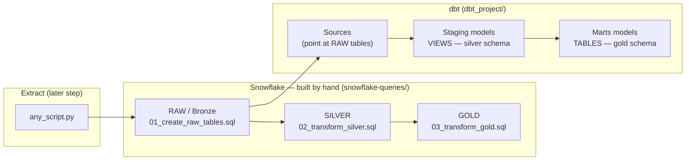

# 🔄 Data Flow / Architecture

Based on the target architecture: a Python script lands data into Snowflake, then dbt takes over the transformation.

## Reading the diagram

1. **Extract** — `any_script.py` (built in a later round) will pull data from a source system and load it into Snowflake `RAW` tables. For now, `snowflake-queries/01_create_raw_tables.sql` seeds this data manually with `INSERT` statements, so you can start learning dbt today without waiting on the Python step.
2. **Manual pipeline** — `02_transform_silver.sql` and `03_transform_gold.sql` show the *traditional*, hand-written way of moving data through Bronze → Silver → Gold. Nothing here is automated, tracked, or tested — that's the pain dbt solves.
3. **dbt pipeline** — dbt declares the same `RAW` tables as **sources**, then rebuilds Silver as **staging views** and Gold as **marts tables**, all version-controlled, documented, and re-runnable with one command (`dbt run`).

Once you compare steps 2 and 3, the value of dbt (repeatability, dependency graph, docs, tests) becomes concrete instead of theoretical.
